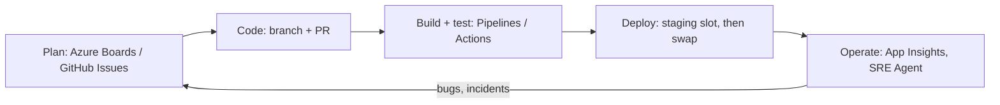

# Delivery flow

```mermaid
flowchart LR
  Plan[Plan: Azure Boards / GitHub Issues] --> Code[Code: branch + PR]
  Code --> Build[Build + test: Pipelines / Actions]
  Build --> Deploy[Deploy: staging slot, then swap]
  Deploy --> Operate[Operate: App Insights, SRE Agent]
  Operate -->|bugs, incidents| Plan
```
